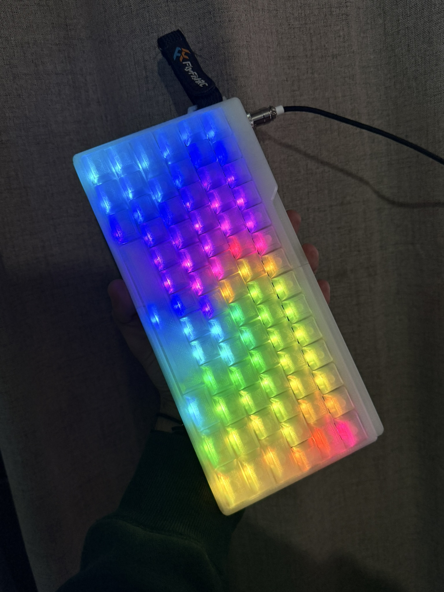
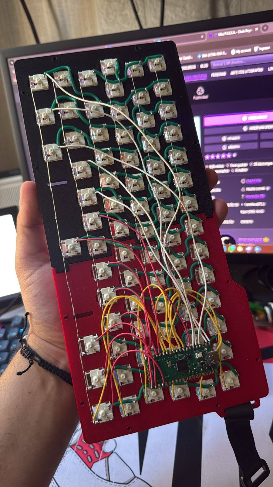
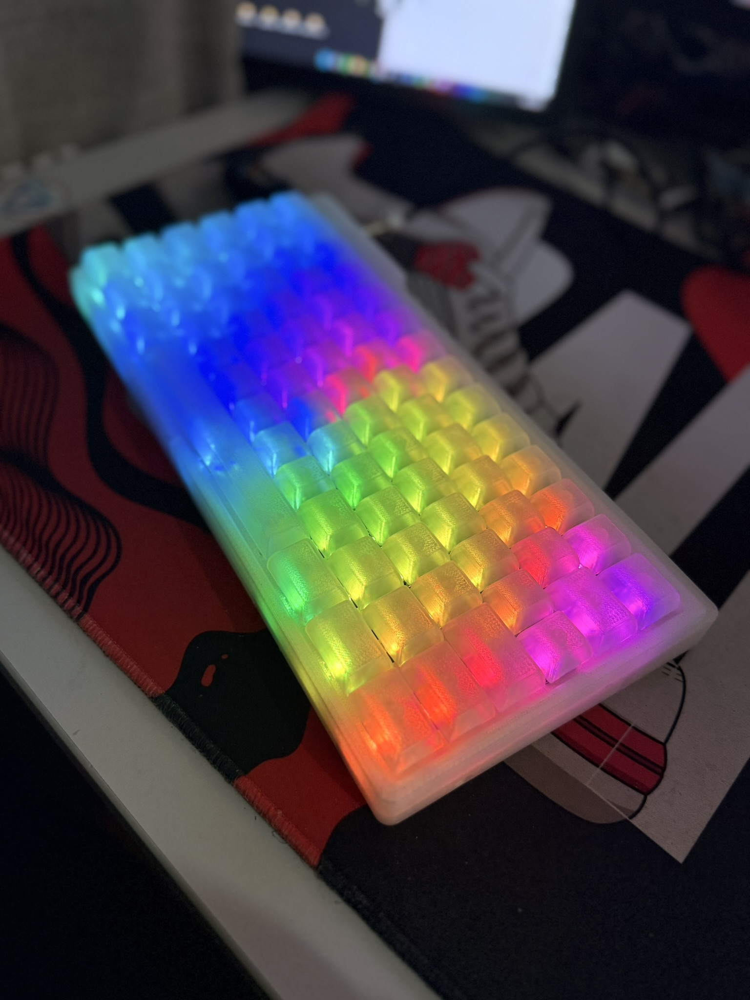
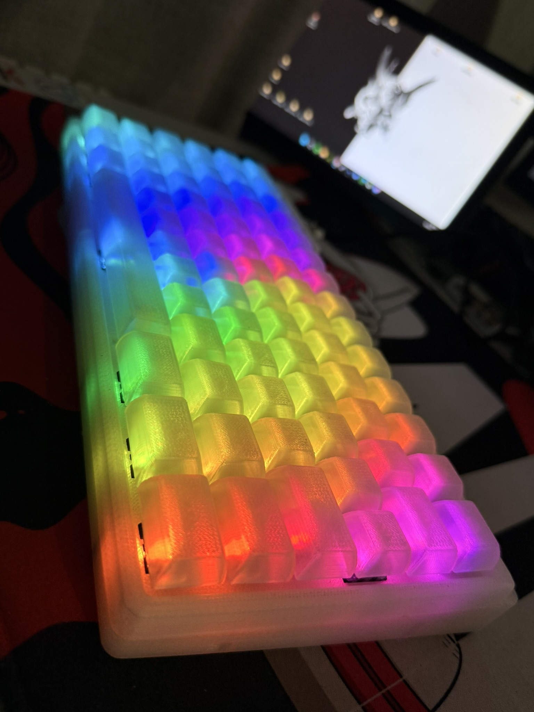
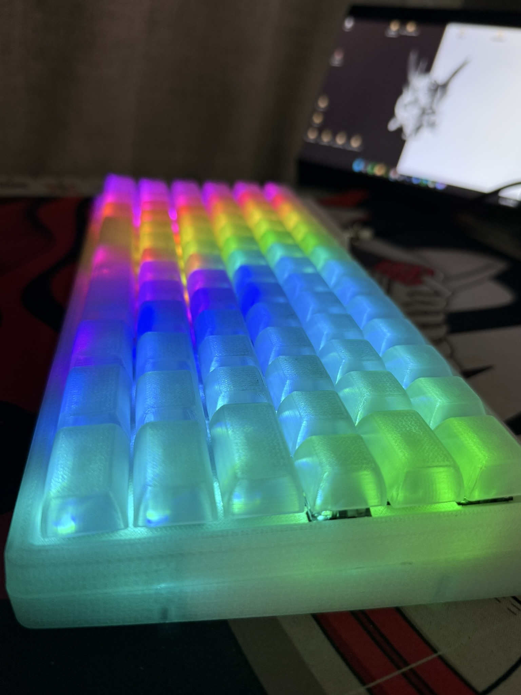

# Teclado 75 DataBlack



Un teclado mecánico custom 75% con distribución ISO, basado en el microcontrolador STM32F401 (Blackpill) y con retroiluminación RGB Matrix completa (75 LEDs WS2812).

* **Keyboard Maintainer:** [Atomik0](https://github.com/Atomik0)
* **Hardware Supported:** PCB Teclado 75, Controlador STM32F401 (Blackpill)
* **Características:**
  * Distribución 75% ISO
  * 75 LEDs RGB individuales (WS2812)
  * Soporte completo para VIA y RAW HID
  * Efectos RGB Matrix avanzados

## Requisitos Previos: QMK MSYS (Windows)

Si estás utilizando Windows, es obligatorio usar [QMK MSYS](https://msys.qmk.fm/) para poder compilar y flashear el firmware. QMK MSYS provee el entorno Linux necesario con todas las dependencias.

1. Descarga e instala la última versión de **QMK MSYS**.
2. Abre la terminal de **QMK MSYS** (no uses CMD ni PowerShell estándar para estos comandos).
3. Configura el entorno si es tu primera vez ejecutando `qmk setup`.
4. Navega hasta el directorio raíz de `qmk_firmware` (ej: `cd /c/Users/TuUsuario/qmk_firmware`).

*Importante:* Si utilizas o creas scripts de prueba o automatización, estos comandos deben ejecutarse dentro del entorno de QMK MSYS. Es recomendable crear scripts de bash (`.sh`) y ejecutarlos desde esa terminal para evitar errores de compilación.

## Compilar el Firmware

Para compilar el firmware (`default` o `via`) para este teclado, utiliza el comando oficial del CLI de QMK. Ejecuta:

```bash
qmk compile -kb teclado75 -km default
```
*(Puedes cambiar `default` por `via` si deseas compilar el keymap de VIA).*

## Flashear el Firmware

Para flashear el firmware compilado en la placa Blackpill (STM32F401), ejecuta el siguiente comando:

```bash
qmk flash -kb teclado75 -km default
```

Cuando la terminal muestre un mensaje indicando que está esperando el dispositivo, debes poner el teclado en modo bootloader.

## Entrar al modo Bootloader (DFU)

Puedes entrar al bootloader de las siguientes maneras:

* **Bootmagic reset**: Mantén presionada la tecla en la posición (0,0) de la matriz (usualmente la tecla de Escape) mientras conectas el teclado por USB.
* **Botón físico de reset**: Presiona brevemente el botón `BOOT0` y luego el botón `NRST` en la placa Blackpill, o usa el botón de reset de la PCB si está disponible.
* **Código de tecla (Keycode)**: Si tienes la tecla `QK_BOOT` asignada en tu mapa de teclas, presiónala.

## Soporte VIA

Este teclado soporta configuración en tiempo real a través de [VIA](https://usevia.app/). Asegúrate de cargar el archivo `via.json` (ubicado en la raíz de este repositorio) en la pestaña "Design" de VIA si la placa aún no ha sido aprobada en el repositorio principal de VIA.

## Galería

Aquí tienes algunas imágenes del proyecto:

### Placa y Componentes


### Iluminación RGB




### Diseños y Renders


